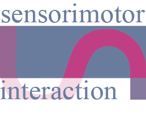

<!-- PROJECT SHIELDS -->
<!--
*** I'm using markdown "reference style" links for readability.
*** Reference links are enclosed in brackets [ ] instead of parentheses ( ).
*** See the bottom of this document for the declaration of the reference variables
*** for contributors-url, forks-url, etc. This is an optional, concise syntax you may use.
*** https://www.markdownguide.org/basic-syntax/#reference-style-links
-->
[![Contributors][contributors-shield]][contributors-url]
[![Forks][forks-shield]][forks-url]
[![Stargazers][stars-shield]][stars-url]
[![Issues][issues-shield]][issues-url]
[![MIT License][license-shield]][license-url]

<!-- PROJECT LOGO -->
 

  

<h3 align="center">Foot Pedal Control - Embodied Vibrotactile Feedback</h3>

  

    The Role of Vibrotactile Feedback in Performance and Perceived Control
     
    <b>We'd love to get your feedback and know if you want to explore this research further.A</b>
     
<!--      
    <a href="https://github.com/sensint/Servo_Haptics/issues">Report Bug</a>
    ·
    <a href="https://github.com/sensint/Servo_Haptics/issues">Request Feature</a> -->
  

## About The Project
